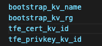
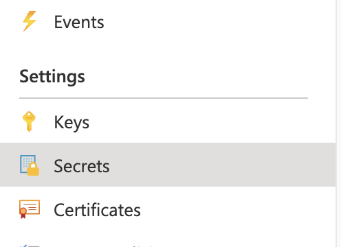
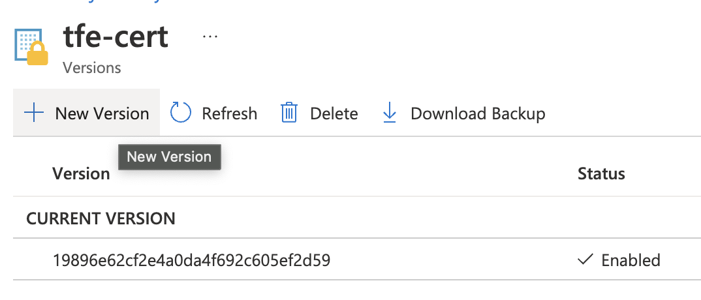
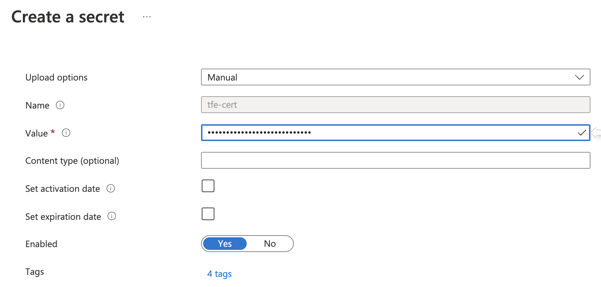
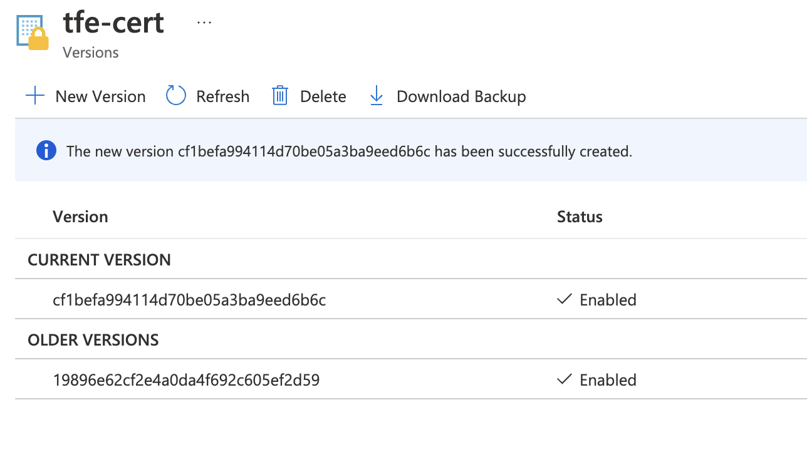
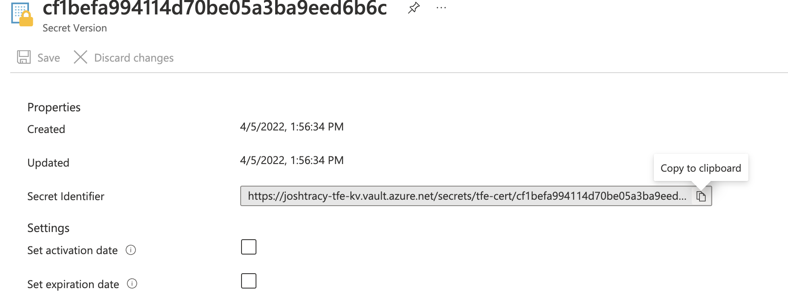
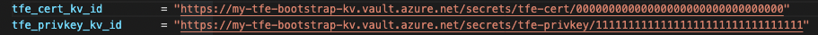

# Certificate Management

  * [Purpose](#purpose)
  * [Prerequisites](#prerequisites)
  * [Certificate Rotation](#certificate-rotation)
    * [Step 1. Encoding Your Certificate and Key](#step-1-encoding-your-certificate-and-key)
    * [Step 2. Upload Your New Certificates to Azure Key Vault](#step-2-upload-your-new-certificates-to-azure-key-vault)
    * [Step 3. Adding the New Secrets to the Module](#step-3-adding-the-new-secrets-to-the-module)
    * [Step 4. Applying the Changes](#step-4-applying-the-changes)
  * [Troubleshooting](#troubleshooting)
    * [Verifying Your Certificates and keys are in PEM Format](#verifying-your-certificates-and-keys-are-in-pem-format)
    * [Comparing the Cert and Key to Ensure Correct Pairing](#comparing-the-cert-and-key-to-ensure-correct-pairing)

### Purpose


The purpose of this document is to inform TFE operators and owners how to rotate TLS/SSL certificates when TFE is managed using this module.

### Prerequisites 
   * It is assumed you are managing your TFE deployment using this module
   * Permissions to edit and retrieve secrets in the Azure Key Vault

## Certificate Rotation

The `*.tfvars` file used to specify your variables contains four variables related to TLS/SSL certificates:



| Variable            | Purpose                                          | 
| ------------------- | ------------------------------------------------ |
|  bootsrap_kv_name   | The name of the key vault that holds the secrets |
|  bootsrap_kv_rg     | The name of the resource group that contains the key vault |
|  tfe_cert_kv_id     | The ID of the secret that contains the base64 encoded certificate |
|  tfe_privkey_kv_id  | The ID of the secret that contains the base64 encoded private key |

### Step 1. Encoding Your Certificate and Key

The certificate and matching private key must be base64 encoded and placed as a string into a secret in Azure Key Vault.

> Note: Ensure the certificate and key are in PEM format before proceeding.

  * In your terminal, run the following commands:

  ```
  cat my.crt | base64
  cat my.key | base64
  ```

  * Copy the outputs and continue to step 2


### Step 2. Upload Your New Certificates to Azure Key Vault

  * Navigate to your key vault and click on the "Secrets" tab on the left hand side:

  

> Note: The cert and key are stored as strings in secrets, NOT as certificates or keys. This Terraform module will decode the base64 encoded strings back into a PEM format certificate and key.

  * Click on the `tfe-cert` secret and click "New Version" in the top left:

  

  * Paste the new base64 encoded certificate string into the "value" box, keeping all other options the same and hit "Create" :

  

  * The new version will be uploaded under "CURRENT VERSION" and the old will fall under "OLDER VERSIONS". Both will be enabled. Only disable the older version after you have verified the current version works as expected. 

  

  * Repeat this process for the secret `tfe-privkey`

### Step 3. Adding the New Secrets to the Module

  * Click on the new secret you just uploaded and copy the "Secret Identifier" URL:

  

  * Paste the copied URL into your `*.tfvars` file for the variable `tfe_cert_kv_id`

  

  * Repeat this process for `tfe_privkey_kv_id` as shown above

### Step 4. Applying the Changes

  * To apply the new certificates, run a `terraform plan` to view what resources will change.

  > Note:  The custom data script in this module `tfe_custom_data.sh.tpl` will retrieve the new certificate from Key Vault. This will cause a new VM to be created, and the server certificate will be rotated. 

  * Once everything is in place, and a maintenance window is established, run `terraform apply` to apply the new certificate. 

  ## Troubleshooting 

  ### Verifying Your Certificates and keys are in PEM Format

```
openssl x509 -inform PEM -in cert.pem
openssl rsa -inform PEM -in privkey.pem
```

  * If they are not in PEM format, run the following:
  ```
  openssl x509 -in cert.cer -out cert.pem -outform PEM
  openssl rsa -in privkey.key -text > privkey.pem
  ```
### Comparing the Cert and Key to Ensure Correct Pairing

* Run the commands below. If both outputs match, you have the correct key for your certificate.

> Note: If the outputs do not match, contact the creator of the CSR that was submitted to your CA and ensure you have the proper key and certificate. 

```
openssl x509 -noout -modulus -in cert.crt | openssl sha256
openssl rsa -noout -modulus -in privkey.txt | openssl sha256
```


