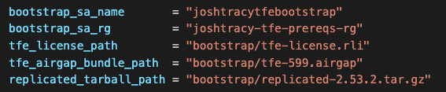
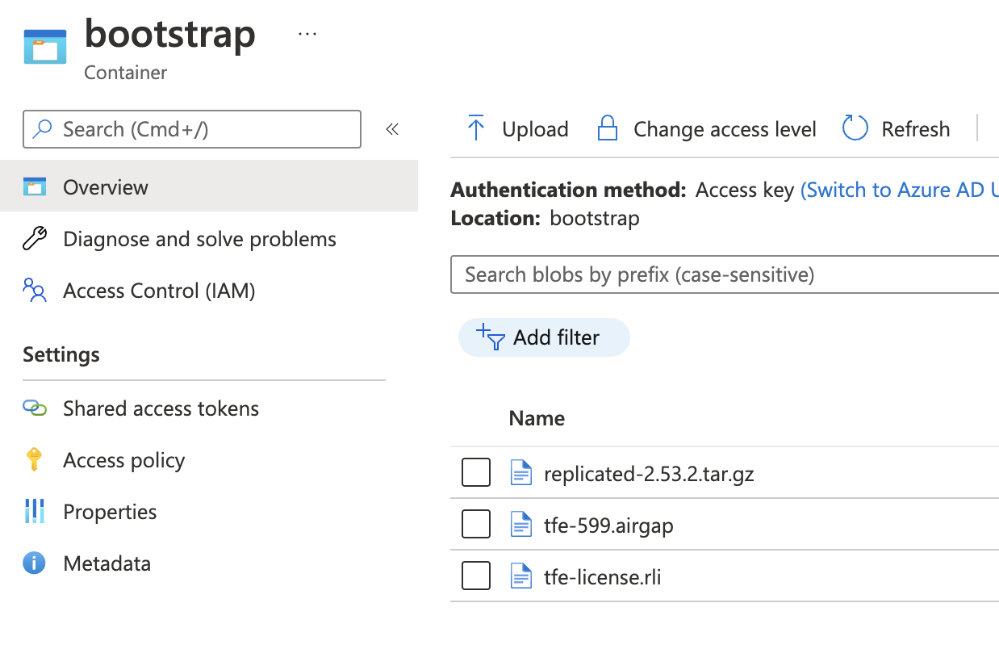
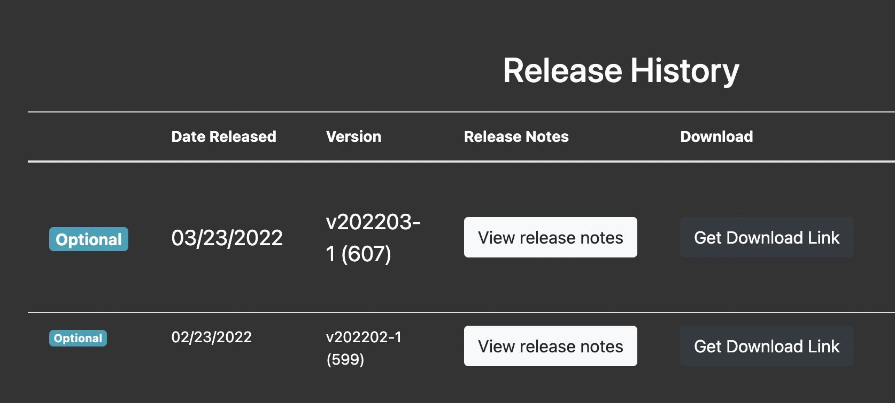
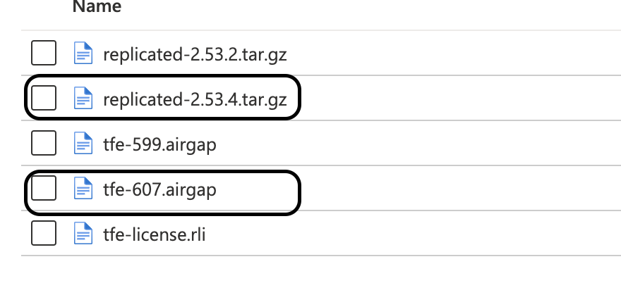
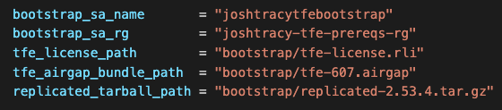

# Upgrading TFE Versions
- [Upgrading TFE Versions](#upgrading-tfe-versions)
  - [Purpose](#purpose)
  - [Before Upgrading](#before-upgrading)
  - ["Online" Upgrades](#online-upgrades)
  - ["Airgap" Upgrades](#airgap-upgrades)
    - [Airgap Background](#airgap-background)
    - [Retrieving a New Airgap Bundle Version](#retrieving-a-new-airgap-bundle-version)
    - [Retrieving a New Version of Replicated](#retrieving-a-new-version-of-replicated)
    - [Airgap Upgrade Procedure](#airgap-upgrade-procedure)
<p>&nbsp;</p>

## Purpose
The purpose of this document is to provide upgrade procedures for TFE owners and operators. Procedures for both _online_ and _airgap_ installation methods are provided. These procedures are specific to if TFE was deployed on Azure via this module accelerator only.
<p>&nbsp;</p>

## Before Upgrading

1. Verify your current version of TFE. You can find the version at the footer of any web page within the TFE application. On older versions, you may need to log in to the Admin Console/Replicated Dashboard (accessed on port 8800) to see the version.

2. Ensure there is a recent PostgreSQL database backup. This module defaults to setting the max backup retention of `35` days (see `backup_retention_days` attribute within [postgresql.tf](../postgresql.tf)).
   > Per Azure [documentation](https://docs.microsoft.com/en-us/azure/postgresql/flexible-server/concepts-backup-restore): "Azure Database for PostgreSQL - Flexible Server automatically performs regular backups of your server. You can then do a point-in-time recovery (PITR) within a retention period that you specify. The overall time to restore and recovery typically depends on the size of data and the amount of recovery to be performed."

3. Determine the target TFE version by visiting the [TFE Releases Overview](https://www.terraform.io/enterprise/releases) page. If your installation method is _airgap_, also note the associated **Recommended Replicated CLI** version within the releases matrix.
<p>&nbsp;</p>

## "Online" Upgrades

1. Edit the `tfe_release_sequence` input variable value in your deployments' `*.tfvars` file with the new **Release Sequence** version:
```
tfe_release_sequence = 660
```

2. Run `terraform plan` and verify a successful plan. This particular change should only trigger the `azurerm_linux_virtual_machine_scale_set.tfe` to change.

3. During a maintenance window, run `terraform apply`. TFE will become temporarily unavaiable as the Terraform apply will trigger the Azure VM Scale Set to reimage the running VM due changing the input variable values.

>Note: this process can take approx 10-15 minutes as the cloud-init process ([tfe_custom_data.sh.tpl](../templates/tfe_custom_data.sh.tpl)) will rerun after the VM is reimaged.

4. Log into TFE and verify the new version appears at the footer of any web page within the TFE application.
<p>&nbsp;</p>

## "Airgap" Upgrades

### Airgap Background

You will have defined the following variables in you deployments `*.tfvars` file if you deployed TFE using this module:



These variables map to files in the `bootstrap_sa_account` storage account:



During the initial deployment, you placed the `tfe-license.rli`,  `tfe-xxx.airgap`, and the `replicated.x.x.x.tar.gz` in this storage account. During the Terraform apply, the [tfe_custom_data.sh.tpl](../templates/tfe_custom_data.sh.tpl) script retrieved these files during the TFE install process by interpolating these variables into the script.
<p>&nbsp;</p>


### Retrieving a New Airgap Bundle Version

Upon purchasing TFE, your HashiCorp Customer Success Manager (CSM) should have provided you with setup instructions for the TFE airgap bundle download URL and password. This is how you will download your new `tfe-***.airgap` bundle. If you do not have the download URL or password, contact your Hashicorp Customer Success Manager (CSM).

Navigate to the URL in a web browser and enter your password to get through to the available releases page. Download the desired version by clicking the associated "Get Download Link" button:


<p>&nbsp;</p>

### Retrieving a New Version of Replicated

> Note: Only update Replicated if the [TFE Releases Overview](https://www.terraform.io/enterprise/releases) matrix shows a new associated **Recommended Replicated CLI** version.

Download the latest version of Replicated via the command below, or by navigating [here](https://help.replicated.com/docs/native/customer-installations/airgapped-installations/) in a web browser.

 ```
 wget https://s3.amazonaws.com/replicated-airgap-work/replicated.tar.gz
 ```

Previous versions can be downloaded from URLs following the pattern:
https://s3.amazonaws.com/replicated-airgap-work/stable/replicated-<version>%2B<version>%2B<version>.tar.gz

For example:
https://s3.amazonaws.com/replicated-airgap-work/stable/replicated-2.28.0%2B2.28.0%2B2.28.0.tar.gz == Replicated version `2.28.0`.

> See the Replicated documentation at https://help.replicated.com/docs/native/customer-installations/airgapped-installations/
<p>&nbsp;</p>

### Airgap Upgrade Procedure

1. Upload the new `tfe-xxx.airgap` file, and if applicable per the TFE releases matrix, the new `replicated-x.x.x.tar.gz` file to the "bootstrap" storage account container:



2. Edit the input variable values of your deployments' `*.tfvars` file to reflect the new filenames:



3. Run `terraform plan` and verify a successful plan. This particular change should only trigger the `azurerm_linux_virtual_machine_scale_set.tfe` to change.

4. During a maintenance window, run `terraform apply`. TFE will become temporarily unavaiable as the Terraform apply will trigger the Azure VM Scale Set to reimage the running VM due changing the input variable values.

>Note: this process can take approx 10-15 minutes as the cloud-init process ([tfe_custom_data.sh.tpl](../templates/tfe_custom_data.sh.tpl)) will rerun after the VM is reimaged.

5. Log into TFE and verify the new version appears at the footer of any web page within the TFE application.